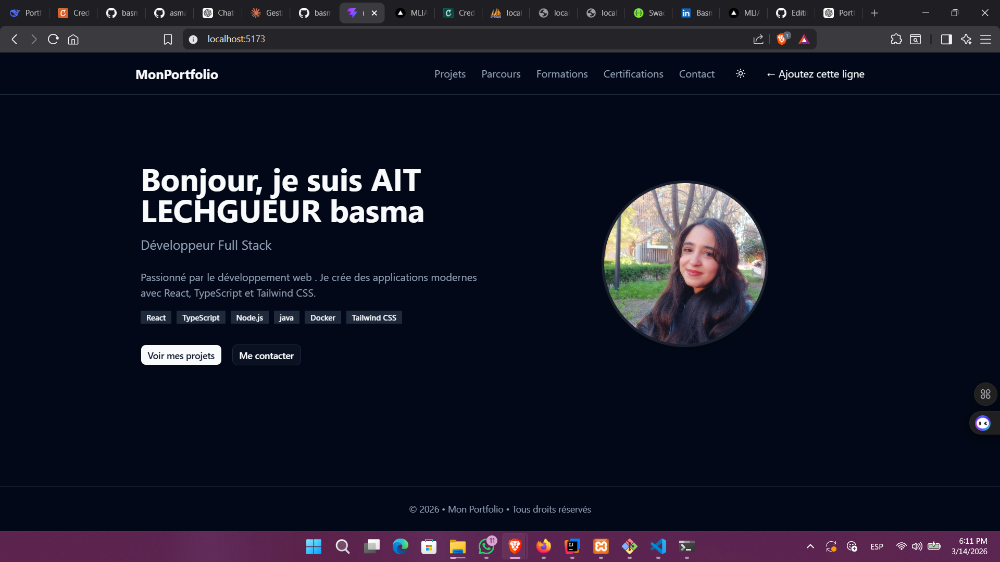
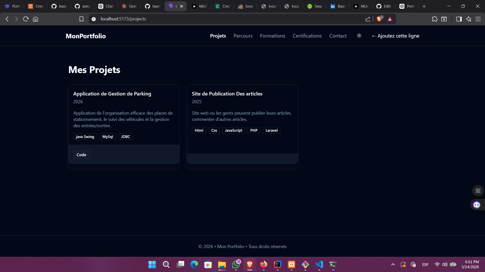
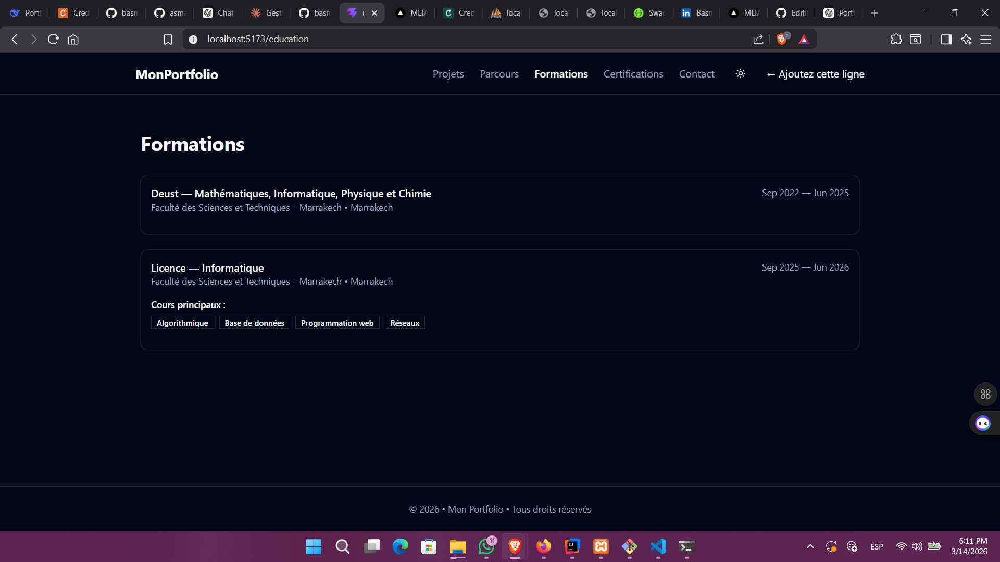
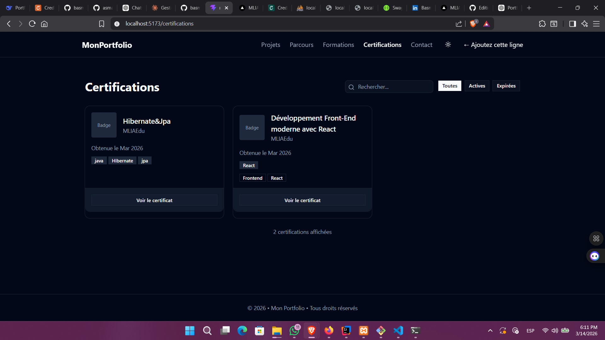
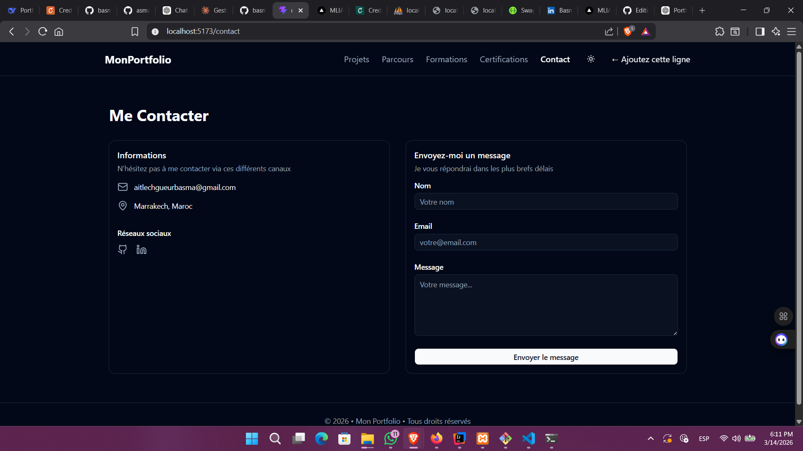

# 💼 Portfolio React Pro #
---
Un portfolio professionnel moderne développé avec React + Vite + TypeScript, utilisant Tailwind CSS et shadcn/ui pour une interface élégante et responsive.

Ce projet permet de présenter :

Profil professionnel

Projets réalisés

Parcours académique et professionnel

Certifications avec badges

Compétences

Contact

Le projet est optimisé pour la performance, le SEO, et peut être déployé facilement sur Vercel.
---
# 🚀 Technologies utilisées #

---

⚛️ React

⚡ Vite

🟦 TypeScript

🎨 Tailwind CSS

🧩 shadcn/ui

🧭 React Router DOM

🎞 Framer Motion

🧠 React Helmet (SEO)

🧹 ESLint + Prettier
---
# 📂 Structure du projet #
---
src/
│
├── app/
│   ├── router.tsx
│   └── RootLayout.tsx
│
├── components/
│   ├── ui/
│   └── CertificationCard.tsx
│
├── pages/
│   ├── Home.tsx
│   ├── Projects.tsx
│   ├── Experience.tsx
│   ├── Education.tsx
│   ├── Certifications.tsx
│   └── Contact.tsx
│
├── data/
│   ├── profile.ts
│   ├── projects.ts
│   ├── education.ts
│   └── certifications.ts
│
├── index.css
└── main.tsx
---
Les données sont centralisées dans src/data pour faciliter la modification du contenu sans toucher aux composants.
---
# ⚙️ Installation du projet #
---
1️⃣ Cloner le projet
git clone https://github.com/votre-username/mon-portfolio.git
cd mon-portfolio
2️⃣ Installer les dépendances
npm install
3️⃣ Lancer le serveur de développement
npm run dev

Le projet sera accessible sur :

http://localhost:5173
---
# 🧪 Scripts disponibles #
---
Commande	Description 
---
npm run dev	Lance le serveur de développement
npm run build	Build de production
npm run preview	Prévisualiser la version production
npm run lint	Vérifier les erreurs ESLint
npm run format	Formatter le code avec Prettier

---
---
# 📄 Pages du portfolio #
---
---
Le portfolio contient plusieurs pages principales :

---
# 🏠 Home #
---
Présentation générale :

Nom

Rôle

Description

Liens vers projets et contact

---
# 💻 Projects #
---
Liste des projets avec :

description

technologies utilisées

lien vers le code GitHub

lien vers la démo

---
# 🧑‍💼 Experience # 
---
Parcours professionnel et expériences.

---
# 🎓 Education #
---
Formations académiques avec :

université

diplôme

dates

cours principaux

réalisations

---
# 🏅 Certifications #
---
Affichage des certifications avec :

organisme

date d’obtention

compétences associées

lien de vérification

Les certifications peuvent être filtrées par mot-clé.

---
# 📬 Contact #
---
Permet aux visiteurs de :

contacter le développeur

accéder aux réseaux professionnels

--- 
# 🗂 Gestion des données #
---
Toutes les informations du portfolio sont stockées dans :

src/data/

Exemple :

profile.ts
projects.ts
education.ts
certifications.ts

Cela permet de mettre à jour le portfolio facilement sans modifier les composants.

---
# 🎨 Interface utilisateur #
---
Le design utilise :

Tailwind CSS pour le style

shadcn/ui pour les composants

Framer Motion pour les animations

Fonctionnalités UI :

responsive design

dark mode

cartes interactives

navigation fluide

---
# 🔍 SEO #
---
Le projet utilise React Helmet pour :

gérer les titres des pages

définir les meta descriptions

améliorer le référencement

Exemple :

<Helmet>
<title>Portfolio - Nom Prénom</title>
<meta name="description" content="Portfolio développeur React" />
</Helmet>
---
#🌙 Dark Mode #
---

Le projet supporte le mode sombre avec un bouton toggle.

Le thème est sauvegardé dans localStorage.

---
# 📸 Captures d'écran #
---
 # 🏠 Page Home # 

# 💻 Page Projects #

# 🎓 Page Education #

# 🏅 Page Certifications #

# 📬 Page Contact #

---
# 📦 Build du projet #

Pour générer la version production :

npm run build

Les fichiers optimisés seront générés dans :

dist/

# 🌍 Déploiement sur Vercel # 

1️⃣ Push sur GitHub
git add .
git commit -m "Portfolio v1"
git push
2️⃣ Importer le projet dans Vercel

Aller sur :

https://vercel.com

Puis :

New Project → Import GitHub Repository

Configuration :

Framework : Vite
Build Command : npm run build
Output Directory : dist

---
# Lien de deployement
---

https://portfolio-drab-two-v4yfsb6zf2.vercel.app/

---
# 👨‍💻 Auteur #
---
Nom : AIT LECHGUEUR BASMA
